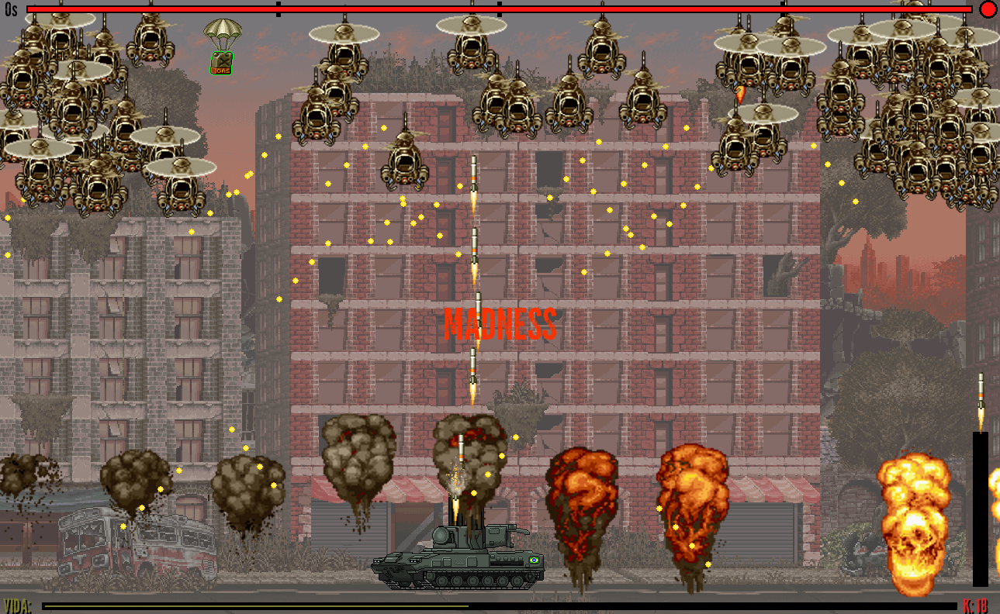

# jogo_exemplo
 Made in C (codeblocks) with Allegro library.
 Project made during the eletronic technican course - 2019.

 Status: unfinished.
 Multiple pendencies related to translations to english and to code and file organization.

Gameplay: https://www.youtube.com/watch?v=Rw6BwOULbRc

 To run the game, you should compile the project with Codeblocks + GCC compiler. If it does not build, verify the path to Allegro's library that is in the same folder of the project, using [this video](https://www.youtube.com/watch?v=xH8mpOfRGxE&ab_channel=KamrulHassan) as reference.
 
 Project based in fixbyproximity's guide:
 http://fixbyproximity.com/2d-game-development-course/
